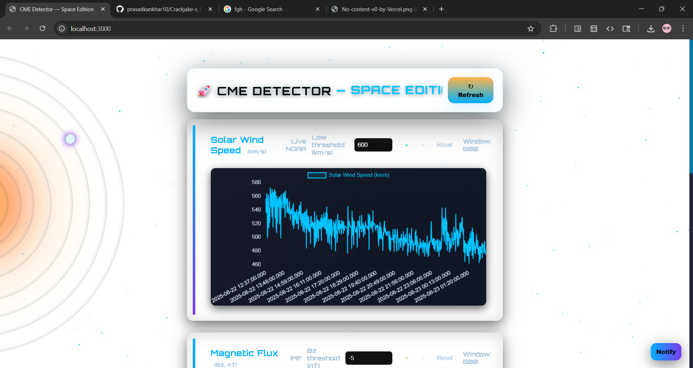

CME Detector — Space Edition
=============================

Quickly run and explore the CME Detector web UI and server in this repo.

What this project is
- Node.js + Express backend that polls NOAA solar-wind products, runs a small detection/score/anomaly pipeline, and serves a lightweight frontend.
- Frontend: static files under `public/` (Chart.js charts, prediction card, event list, export controls).
- Optional MongoDB persistence for recordings and exports.

Requirements
- Node.js (16+ recommended)
- npm
- Optional: MongoDB (local or remote) if you want persistence and streamed exports

Install and run

1) Install dependencies

```powershell
npm install
```

2) Start (default: no DB required for basic UI)

```powershell
node .\app.js
```

Environment variables
- `PORT` — HTTP port (default: 3000)
- `MONGO_URL` — optional MongoDB connection string (default used by helper is mongodb://127.0.0.1:27017 if you run locally)
- `MONGO_DB` — optional DB name (default: cme_detector)

Server endpoints (HTTP)
- GET /                — frontend (index.html)
- GET /latest?n=NUM    — recent plasma/mag samples and quick EWMA forecasts (default n=500)
- GET /events          — current in-memory detections (alias for displayed events)
- GET /predict?n=NUM   — short-term forecast and quick summary (default n=200)
- GET /export?format=csv|json&limit=N — download detections (CSV streaming when Mongo is available)
  - CSV: streamed from Mongo cursor (efficient), falls back to in-memory array when DB is not connected.
  - JSON: small response, returned as application/json with Content-Disposition attachment.

Frontend notes (public/index.html)
- Solar Wind Speed chart (left) now highlights segments at-or-above a configurable threshold.
  - Change threshold with the numeric input in the Solar Wind Speed card header (default 600 km/s).
- Magnetic Flux (Bz) chart highlights segments at-or-below a configurable threshold (default -5 nT).
  - Change Bz threshold with the numeric input in the Magnetic Flux card header.
- Prediction / Short-term Forecast card
  - Shows quick score, next-step forecasts, anomaly text.
  - Export controls: choose CSV or JSON, adjust limit, click Download. CSV uses streaming where possible; a small "Preparing..." spinner shows while the download is prepared.

How to test quickly (PowerShell)

```powershell
# start server
node .\app.js

# quick REST checks
curl.exe http://localhost:3000/latest?n=5
curl.exe http://localhost:3000/predict
curl.exe "http://localhost:3000/export?format=csv&limit=10" -o detections.csv
```

Notes and troubleshooting
- If you want persistent historical records and streamed export, run a MongoDB instance and set `MONGO_URL`/`MONGO_DB` before starting the server. The server logs a "Connected to MongoDB" message on success.
- CSV streaming is implemented using a Mongo cursor when the DB is connected. If Mongo is unreachable, the app writes CSV rows from the in-memory `detections` array.
- If NOAA endpoints return unexpected shapes (transient issues), the server logs warnings — these are handled best-effort.

Development tips
- Frontend scripts are in `public/index.html` and `public/solar.js`. Styles are in `public/space.css`.
- Server logic is in `app.js`. DB helper is `lib/db.js`.

If you want any of the following I can add them:
- Background export job with a progress endpoint for very large exports
- Persisted user preferences (thresholds) in localStorage
- CSS cleanup (move predictive-card inline styles into `space.css`)

That's it — open http://localhost:3000 and explore the UI. If you want a shorter README or additional developer docs, tell me which section to expand.

## Screenshots

Click any image to view full-size. These use the `UI/` folder — replace the files there with real screenshots when ready.

[](./UI/UI1.png)
_Main dashboard showing charts and cards._

[](./UI/UI2.png)
_Solar wind speed chart with high-speed segments highlighted._

[](./UI/UI3.png)
_Predict card and export controls._

[](./UI/UI4.png)
_Responsive mobile layout._
